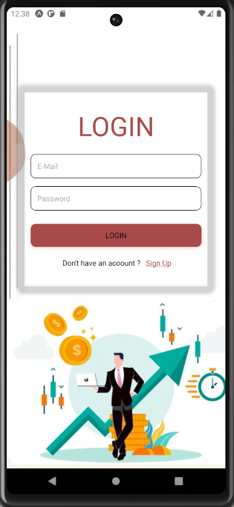
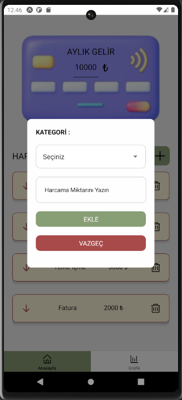
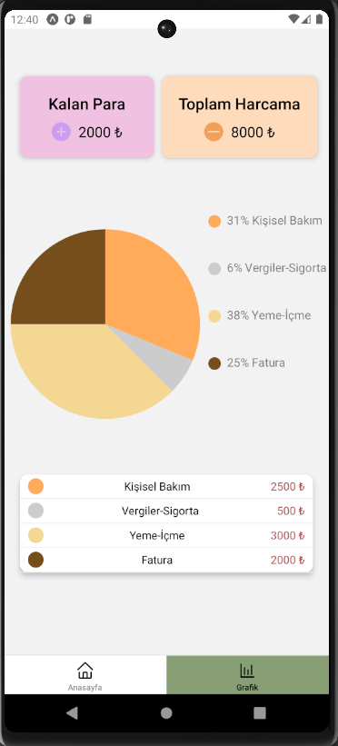

💰 Expense Tracking App

📌 Overview

Expense Tracking App, kullanıcının aylık gelirini girmesine, farklı harcama kategorilerinden seçim yaparak gider eklemesine ve kalan parasını grafik ile görmesine olanak tanıyan bir bütçe yönetim uygulamasıdır.

🎯 Features

✅ Aylık Gelir Belirleme: Kullanıcı, başlangıçta aylık gelirini girer.

✅ Harcama Ekleme: Kullanıcı, belirli kategorilerden harcamalarını ekleyebilir.

✅ Kategoriye Göre Harcamalar: Kullanıcı, harcamalarını farklı kategorilere ayırabilir (örneğin: Gıda, Ulaşım, Eğlence).

✅ Kalan Para Takibi: Kullanıcı, ne kadar bütçesi kaldığını takip edebilir.

✅ Grafik Desteği: Kullanıcı, harcama dağılımını grafik üzerinden görselleştirebilir.

✅ AsyncStorage - Kullanıcı verilerini yerel olarak saklamak için kullanıldı.

